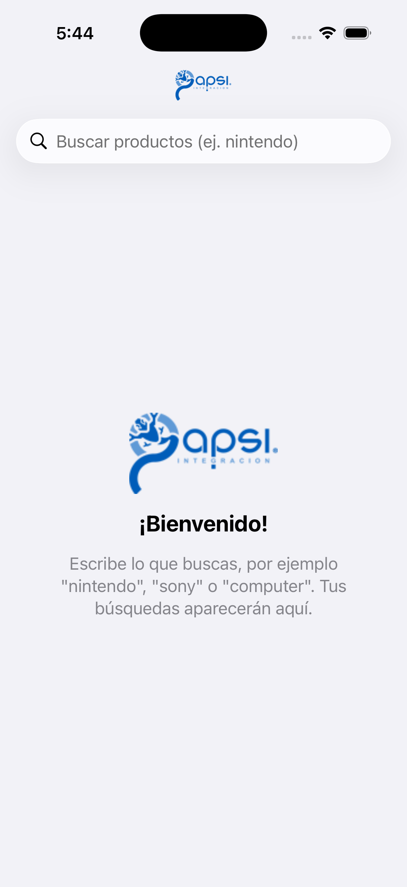
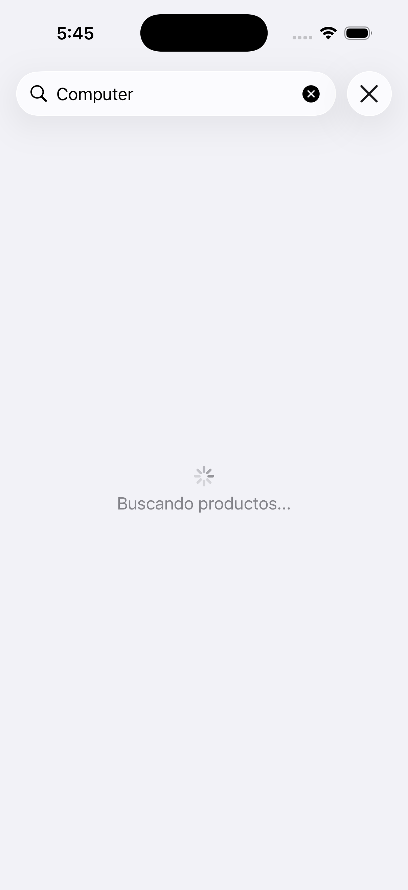
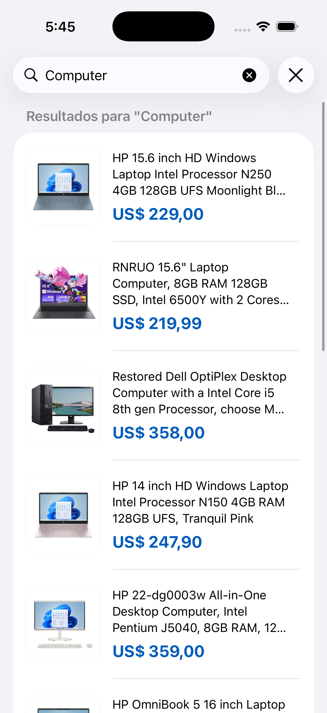
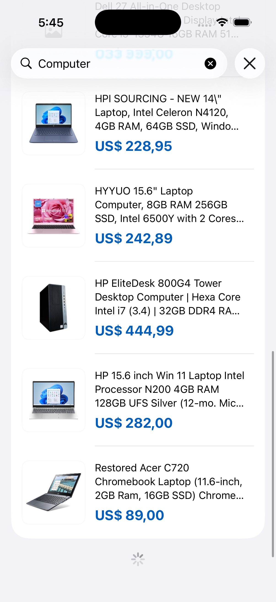
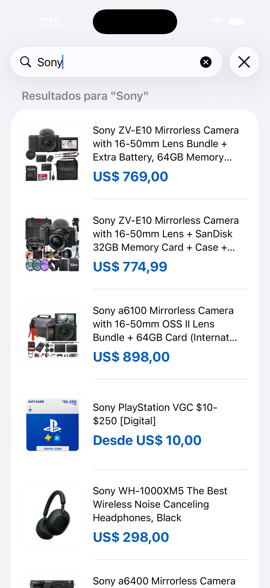
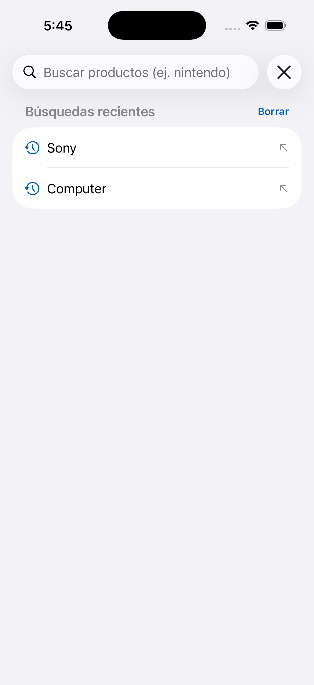
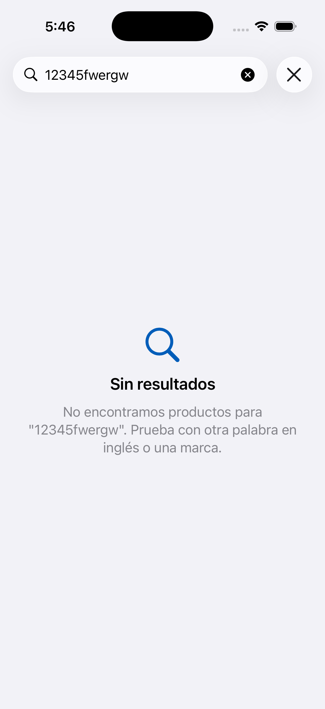
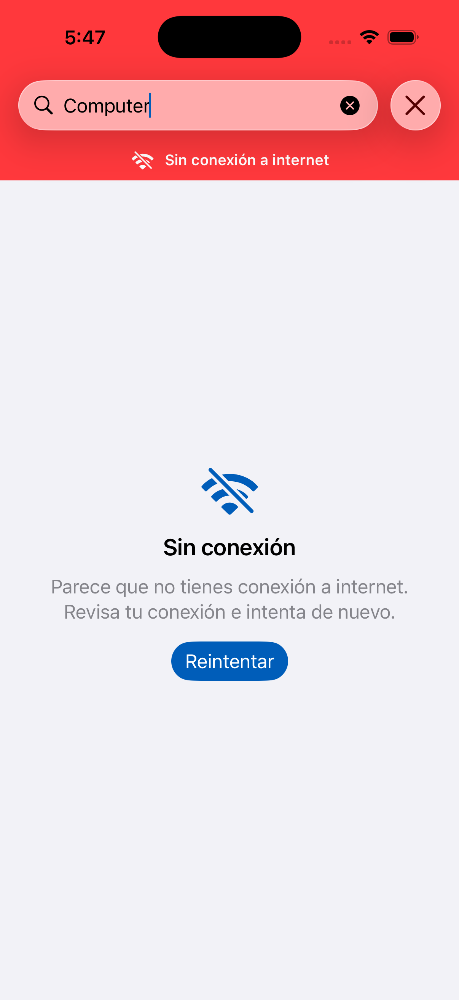

# Prueba Técnica Gapsi – Buscador de productos (iOS)

App nativa de iOS tipo eCommerce para buscar productos en el catálogo de Walmart usando la API de [Axesso en RapidAPI](https://rapidapi.com/).

## ¿Qué hace la app?

- **Busca productos** a partir del texto que escribe el usuario (se recomienda usar palabras en inglés o marcas, por ejemplo `nintendo`, `sony`, `computer`).
- **Muestra un listado** con el título, precio e imagen (thumbnail) de cada producto.
- **Scroll infinito:** conforme el usuario baja en la lista se cargan automáticamente las siguientes páginas de resultados.
- **Historial de búsquedas:** guarda las palabras buscadas y las muestra al abrir la app, incluso después de cerrarla. Al tocar una se vuelve a buscar.
- **Interfaz que no se bloquea:** las llamadas a la API y la lectura del JSON se hacen en segundo plano con `async/await`; mientras tanto se muestran indicadores de carga y mensajes de error con opción de reintentar.
- **Aviso de sin conexión:** si el teléfono se queda sin internet aparece un aviso en la parte de arriba, no se intenta buscar y, cuando vuelve la conexión, la búsqueda que había fallado se reintenta sola.
- **Español e inglés:** si el teléfono está en inglés la app se muestra en inglés; en cualquier otro idioma se muestra en español. Los textos están en `Localizable.xcstrings` (String Catalog).

## Capturas de pantalla

| Bienvenida | Buscando | Resultados | Scroll infinito |
|:---:|:---:|:---:|:---:|
|  |  |  |  |

| Otra búsqueda | Historial | Sin resultados | Sin conexión |
|:---:|:---:|:---:|:---:|
|  |  |  |  |

## Requisitos

- Xcode 16 o superior
- iOS 16.0 o superior
- Swift 6

## Cómo ejecutarla

1. Clona el repositorio.
2. Abre `PruebaTecnicaGapsi.xcodeproj` y ejecuta con `Cmd + R`. La API key ya viene configurada.
3. Para correr las pruebas unitarias usa `Cmd + U`.

### Cambiar la API key

La llave de RapidAPI está en `Config/Secrets.xcconfig`. Para usar otra, solo cambia el valor y vuelve a compilar:

```
RAPIDAPI_KEY = tu_nueva_llave
```

La app la lee desde el `Info.plist`, así que no está escrita en el código Swift.

> **Nota de seguridad:** por ser una prueba técnica, `Secrets.xcconfig` sí se sube al repositorio para que la app funcione al clonarla. En un proyecto real este archivo iría en el `.gitignore` y la llave se guardaría fuera del repositorio, por ejemplo en los secretos del CI (GitHub Actions, Bitrise) que generan el archivo al compilar, o mejor aún detrás de un backend propio para que la llave nunca viaje dentro de la app.

## Arquitectura

Clean Architecture + **MVVM**, separada en tres capas:

```
PruebaTecnicaGapsi/
├── App/            → Punto de entrada y contenedor de dependencias
├── Domain/         → Entidades, casos de uso y protocolos de repositorios (lógica de negocio)
├── Data/           → Llamadas a la API, DTOs, mapeo a entidades y persistencia (UserDefaults)
└── Presentation/   → ViewModel y vistas en SwiftUI
```

- La vista solo habla con el **ViewModel**.
- El ViewModel usa **casos de uso** (buscar productos, guardar/leer/borrar historial).
- Los casos de uso dependen de **protocolos** de repositorio; las implementaciones reales están en `Data`.

## Pruebas

En `PruebaTecnicaGapsiTests` están las pruebas unitarias de los casos de uso (con repositorios y conexión falsos, incluyendo el caso sin internet) y del mapeo de la respuesta de la API.

## Tecnologías

Swift 6 · SwiftUI · Swift Concurrency (async/await) · URLSession · NWPathMonitor · UserDefaults · String Catalogs · XCTest · Sin dependencias externas.
